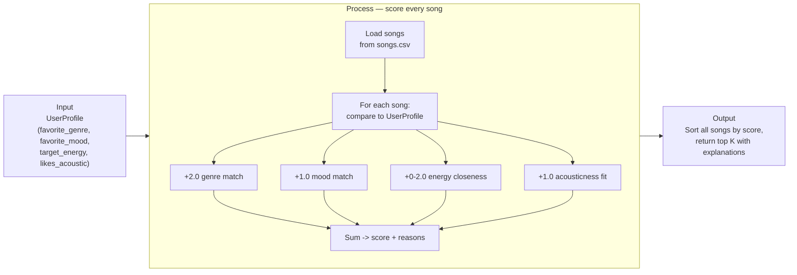

# 🎵 Music Recommender Simulation

## Project Summary

In this project you will build and explain a small music recommender system.

Your goal is to:

- Represent songs and a user "taste profile" as data
- Design a scoring rule that turns that data into recommendations
- Evaluate what your system gets right and wrong
- Reflect on how this mirrors real world AI recommenders

Replace this paragraph with your own summary of what your version does.

---

## How The System Works

Real-world recommenders (Spotify, YouTube, etc.) work by turning both items and users into a shared set of features, then measuring how well a given item's features line up with a user's preferences. They don't just sort by "most popular" or "highest energy" — they score how *close* an item is to what a specific user seems to want, then rank the catalog by that score. My version follows the same idea on a tiny scale: it represents every song as a fixed set of numeric and categorical features, represents a user as a target preference over that same feature space, and scores each song by how well it matches. It prioritizes exact matches on the categorical traits (genre, mood) as the strongest taste signal, then uses distance-based scoring on the numeric traits (energy, acousticness) so a song doesn't win just for being high-energy or acoustic — it wins for being *close to what the user asked for*.

**`Song` features used:**
- `genre` — categorical (e.g. pop, lofi, rock, jazz)
- `mood` — categorical (e.g. happy, chill, intense, relaxed)
- `energy` — numeric, 0–1
- `acousticness` — numeric, 0–1
- `instrumentalness` — numeric, 0–1 (higher = fewer/no vocals)
- `popularity` — numeric, 0–1 (relative catalog popularity)

**`UserProfile` stores:**
- `favorite_genre` — matched against `Song.genre`
- `favorite_mood` — matched against `Song.mood`
- `target_energy` — a 0–1 target compared against `Song.energy`
- `likes_acoustic` — a boolean compared against `Song.acousticness`

**How `Recommender` scores a song** (max 6.0 points):
- Genre match: +2.0 points if `song.genre == favorite_genre`
- Mood match: +1.0 point if `song.mood == favorite_mood`
- Energy closeness: up to +2.0 points, scaled by `1 - abs(song.energy - target_energy)` — rewards proximity to the target, not just high or low energy
- Acousticness fit: +1.0 point if `song.acousticness` is on the correct side of the 0.5 threshold for `likes_acoustic`

**Why these weights:** the 18-song catalog has 16 distinct genres and 13 distinct moods, so exact-match genre/mood scoring is sparse — most songs won't match either. Genre is weighted 2x mood because it's treated as the stronger, more identity-level taste signal, while mood is more situational. Energy gets the same max weight as genre (2.0) specifically because it's continuous and contributes to *every* song's score, giving the ranking something to work with even when no genre/mood match exists. Acousticness is the smallest weight (1.0) since it's a coarse like/dislike threshold rather than a graded similarity score.

**How songs are chosen:** every song in the catalog is scored independently with the rule above, then the full list is sorted by score (highest first) and the top `k` are returned as recommendations.

**Design flow** — how one song moves from the CSV to the final ranked list:



Every song runs through the same 4-part scoring rule independently, then the catalog gets sorted once at the end — this was the plan sketched before writing `score_song` / `Recommender.recommend` in [src/recommender.py](src/recommender.py).

**Potential biases to expect:** because genre (+2.0) and energy (+2.0) carry the heaviest weight while mood only carries +1.0, this system will tend to over-prioritize genre and energy matches, potentially burying a song that's a strong mood fit but the "wrong" genre — e.g. a genuinely happy, upbeat jazz track will likely rank below a merely energy-close pop track for a `favorite_genre="pop"` user, even if the user would have loved the jazz track's mood. It can also over-favor whichever genre/mood happens to be best-represented in the catalog (here, "lofi"/"chill" appear most often), simply because there are more chances for an exact match — not because that genre is objectively better.

---

## Getting Started

### Setup

1. Create a virtual environment (optional but recommended):

   ```bash
   python -m venv .venv
   source .venv/bin/activate      # Mac or Linux
   .venv\Scripts\activate         # Windows

2. Install dependencies

```bash
pip install -r requirements.txt
```

3. Run the app:

```bash
python src/main.py
```

### Running Tests

Run the starter tests with:

```bash
pytest
```

You can add more tests in `tests/test_recommender.py`.

---

## Sample Recommendation Output

User profile: genre=pop, mood=happy, target_energy=0.8, likes_acoustic=False

```
Sunrise City - Score: 5.96
Because: genre matches your favorite (pop); mood matches your favorite (happy); energy (0.82) is very close to your target (0.80); non-acoustic, matching your preference

Gym Hero - Score: 4.74
Because: genre matches your favorite (pop); energy (0.93) is reasonably close to your target (0.80); non-acoustic, matching your preference

Rooftop Lights - Score: 3.92
Because: mood matches your favorite (happy); energy (0.76) is very close to your target (0.80); non-acoustic, matching your preference

Night Drive Loop - Score: 2.90
Because: energy (0.75) is very close to your target (0.80); non-acoustic, matching your preference

Storm Runner - Score: 2.78
Because: energy (0.91) is reasonably close to your target (0.80); non-acoustic, matching your preference
```

**Screenshot or video** *(optional)*: <!-- Insert a screenshot or demo video link here -->

---

## Experiments You Tried

Use this section to document the experiments you ran. For example:

- What happened when you changed the weight on genre from 2.0 to 0.5
- What happened when you added tempo or valence to the score
- How did your system behave for different types of users

---

## Limitations and Risks

Summarize some limitations of your recommender.

Examples:

- It only works on a tiny catalog
- It does not understand lyrics or language
- It might over favor one genre or mood
- `favorite_genre`/`favorite_mood` are single exact-match values, not a spectrum: any song outside the user's one favorite genre and one favorite mood scores 0 on both (3 of the 6 possible scoring points), so the whole non-matching majority of the catalog is differentiated only by the two remaining signals (energy-closeness, acousticness fit) — a much weaker basis for ranking than the "real" preference signal

You will go deeper on this in your model card.

---

## Reflection

Read and complete `model_card.md`:

[**Model Card**](model_card.md)

Write 1 to 2 paragraphs here about what you learned:

- about how recommenders turn data into predictions
- about where bias or unfairness could show up in systems like this


